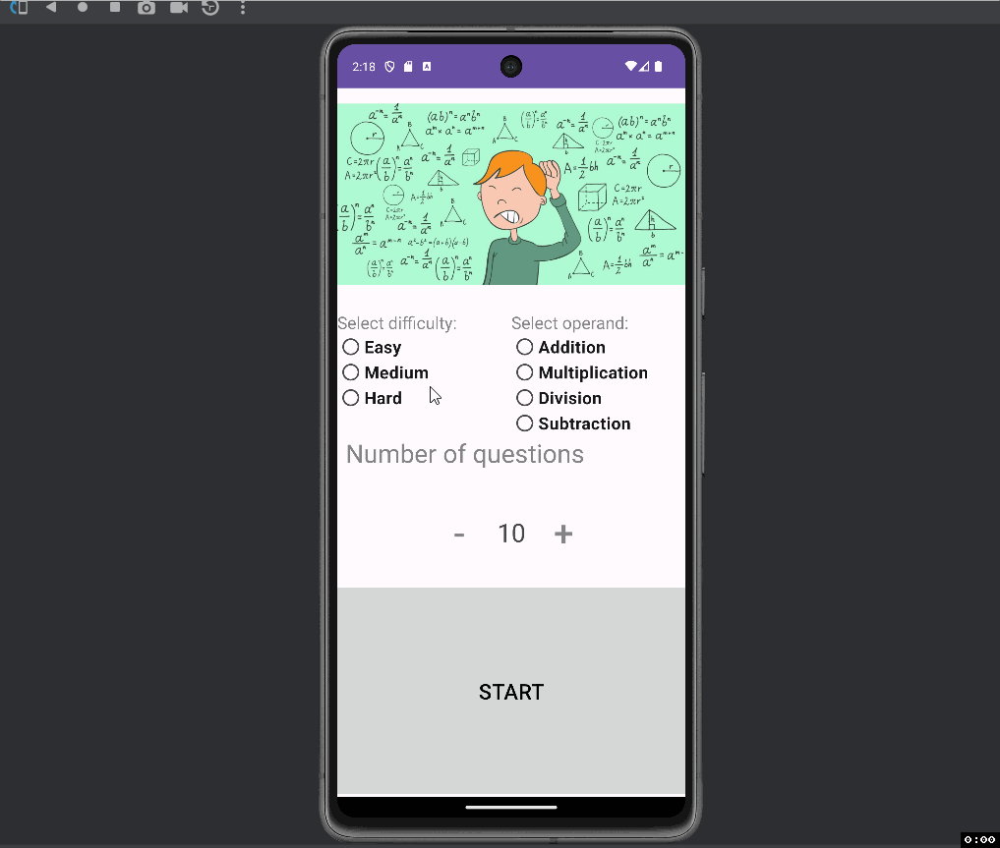

Kiddie Arithmetic!

Description of the project ...

- The project is an application that is created to help kids practice Arithmetic. 

## Functionality 

The following **required** functionality is completed:

* [ ] Activity 2 should send Data to Activity 1 and vice versa
* [ ] Results should be displayed in Activity 1
* [ ] Activity 2 Shows a Toast based on User's answer
* [ ] Activity 2 plays a sound based on user's answer
* [ ] Use of safe args.

The following **extensions** are implemented:

* No Extensions were used. Everything was from Kotlin

## Video Walkthrough

Here's a walkthrough of implemented user stories:

GIF created with [LiceCap](http://www.cockos.com/licecap/).

## Notes

Describe any challenges encountered while building the app.

- I didn't have too much challenges while building this app.

## License

    Copyright [yyyy] [name of copyright owner]

    Licensed under the Apache License, Version 2.0 (the "License");
    you may not use this file except in compliance with the License.
    You may obtain a copy of the License at

        http://www.apache.org/licenses/LICENSE-2.0

    Unless required by applicable law or agreed to in writing, software
    distributed under the License is distributed on an "AS IS" BASIS,
    WITHOUT WARRANTIES OR CONDITIONS OF ANY KIND, either express or implied.
    See the License for the specific language governing permissions and
    limitations under the License.
